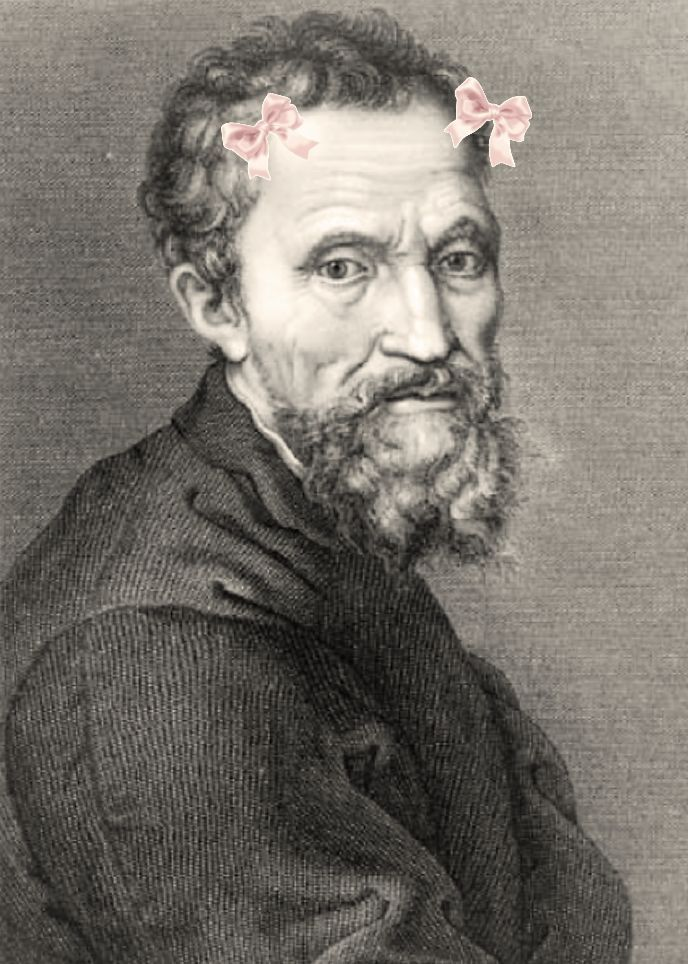

  

 

# Hey, It's Saara here

---

*“An idiot in motion moves faster than a genius at rest.”*

 

### 🔗 Know About Me

<table>
  <tr>
    <td width="30%" align="center" valign="middle">
      
    </td>
    <td width="70%" valign="top">
      <h3>Hey there! I'm Saara 💻</h3>
      

        I'm a Computer Science student passionate about software development, systems, and cloud architecture.
      

      

        I have built small <b>cloud projects</b> and am actively learning <b>Networking fundamentals</b> and <b>Linux system administration</b>.
      

      

        Alongside cloud and networking, I'm mastering <b>Data Structures & Algorithms (DSA)</b> and writing code in <b>C</b>, <b>C++</b>, <b>Python</b>, <b>Java</b>, and <b>JavaScript</b> — while currently learning <b>Rust 🦀</b>!
      

       
      

        <b>⚙️ Tech Stack:</b> 
        
        
        
        
        
        
        
        
      

    </td>
  </tr>
</table>

---

### 🔗 Top Projects & Endeavors

<table>
  <tr>
    <td width="75%" valign="top">
      <ul>
        <li>
          <b>☁️ <a href="https://github.com/meowchan16/aws-cloud-troubleshooting-lab">aws-cloud-troubleshooting-lab</a></b> 
          <i>AWS cloud infrastructure troubleshooting, HCL configuration, and cloud diagnostics lab.</i>
        </li>
         
        <li>
          <b>📊 <a href="https://github.com/meowchan16/aws-cloudwatch-billing-lab">aws-cloudwatch-billing-lab</a></b> 
          <i>AWS CloudWatch metric alarms, cost management, and automated billing notification setups.</i>
        </li>
         
        <li>
          <b>🔐 <a href="https://github.com/meowchan16/aws-iam-troubleshooting-lab">aws-iam-troubleshooting-lab</a></b> 
          <i>AWS Identity and Access Management policies, security role debugging, and permission validations.</i>
        </li>
         
        <li>
          <b>🌐 <a href="https://github.com/meowchan16/multi-vlan-campus-network">multi-vlan-campus-network</a></b> 
          <i>Network engineering lab for multi-VLAN campus network architecture, switching, and routing.</i>
        </li>
      </ul>
    </td>
    <td width="25%" align="center" valign="middle">
      
    </td>
  </tr>
</table>

---

### 🔗 Connect & Philosophy

  
  
  

> *Code is never finished. It only becomes slightly less terrible over time.*
>
> *Every commit I make is essentially just a small, desperate apology to my future self.*

---

### 🔗 Activity & Contribution Analytics

  

