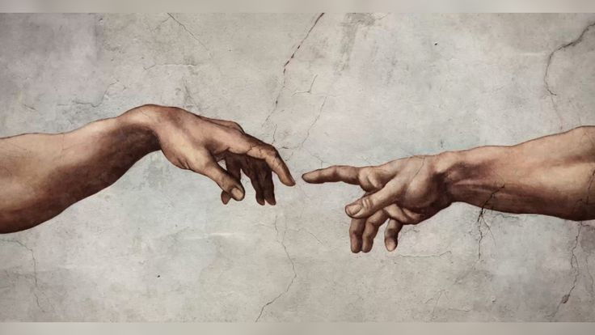

<!-- YOUR UPLOADED CREATION OF ADAM HEADER BANNER -->

  

# Namaste 👋 I'm Saara Suman

---

### 🔗 Know About Me

<table>
  <tr>
    <td width="30%" align="center" valign="middle">
      
    </td>
    <td width="70%" valign="top">
      <h3>Hey there! I'm Saara 💻</h3>
      

        I'm a Computer Science student diving deep into software development and algorithms.
      

      

        By day, I'm building projects, mastering data structures, and writing code in <b>Python</b>, <b>C</b>, <b>C++</b>, <b>Java</b>, and <b>JavaScript</b>.
      

      

        Currently, I'm focusing my energy on exploring low-level concepts and learning <b>Rust 🦀</b> to build safe, high-performance software.
      

       
      

        <b>⚙️ Tech Stack:</b> 
        
        
        
        
        
        
      

    </td>
  </tr>
</table>

---

### 🔗 Top Projects & Endeavors

<table>
  <tr>
    <td width="75%" valign="top">
      <ul>
        <li>
          <b>SYSTEMS & ALGORITHMS (C / C++)</b> 
          <i>Memory-efficient data structures, pointer mechanics, and algorithmic performance testing.</i>
        </li>
         
        <li>
          <b>PYTHON AUTOMATION SUITE</b> 
          <i>A collection of Python scripts built to automate workflows, parsing data with caffeine and print statements.</i>
        </li>
         
        <li>
          <b>JAVA OBJECT-ORIENTED SOFTWARE</b> 
          <i>Clean OOP applications built with strong encapsulation, inheritance, and modular structure.</i>
        </li>
         
        <li>
          <b>RUST MEMORY SAFETY EXPLORATION 🦀</b> 
          <i>Learning zero-cost abstractions, ownership rules, and memory-safe systems programming.</i>
        </li>
      </ul>
    </td>
    <td width="25%" align="center" valign="middle">
      
    </td>
  </tr>
</table>

---

### 🔗 Connect & Philosophy

  
  
  

> *Code is never finished. It only becomes slightly less terrible over time.*
>
> *Every commit I make is essentially just a small, desperate apology to my future self.*

---

### 🔗 Activity & Contribution Analytics

  
  

  

